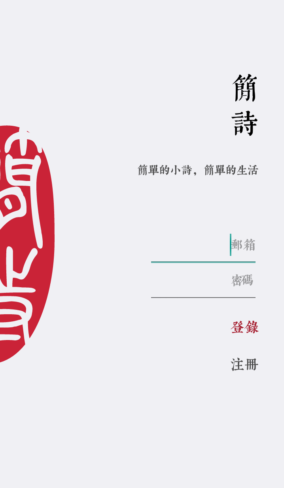
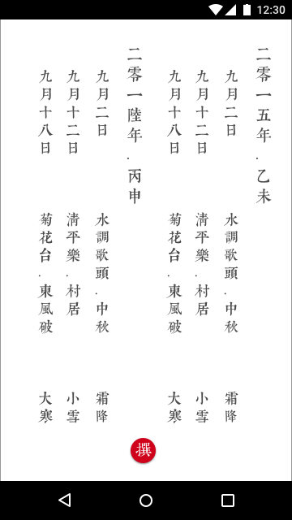
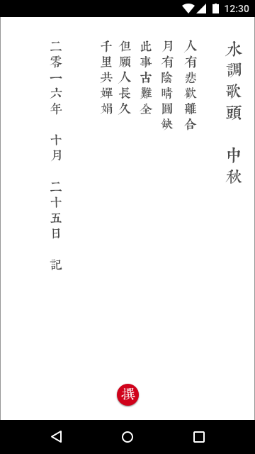

#  jianshi 简诗

A Full-Stack mobile app, including Android side & Server side, Simple-Poem 简诗. You can write poem in graceful & traditional Chinese style.

一款优雅的中国风Android App，包括Android端和Server端。

# Development Progress (development branch:v2.0)
- __[2016/11/06] Configure aliyun server and deploy application by jenkins, install MySql, testing signup & data sync logic__
- __[2016/10/30] Signup & Login UI new design; Screenshot & system Share; and other cool features__
- __[2016/10/25] Data sync function between android and server; Improve server error handling function & config mechanism. [Server+Android]__
- __[2016/09/03] User managment in server side and Signup & Login flow in Android side. [Server+Android]__
- __[2016/08/25] Migrate from `LeanCloud` to `Apache + Mysql + wsgi + Flask` and build my own server framework. [Server]__
- __[2016/08/20] Build server side framework. Using `LeanCloud` & `Python`. [Server]__
- __[2016/08/18] Integrate Dagger Retrofit2 OkHttp3 RxJava etc. [Android]__

# Android UI

# Chinese Blog for jianshi

[如何在一天之内完成一款具备cool属性的Android产品_简书](http://www.jianshu.com/p/cf496fc408b2)

# Inspired By
[《Producter》](http://producter.io/)
