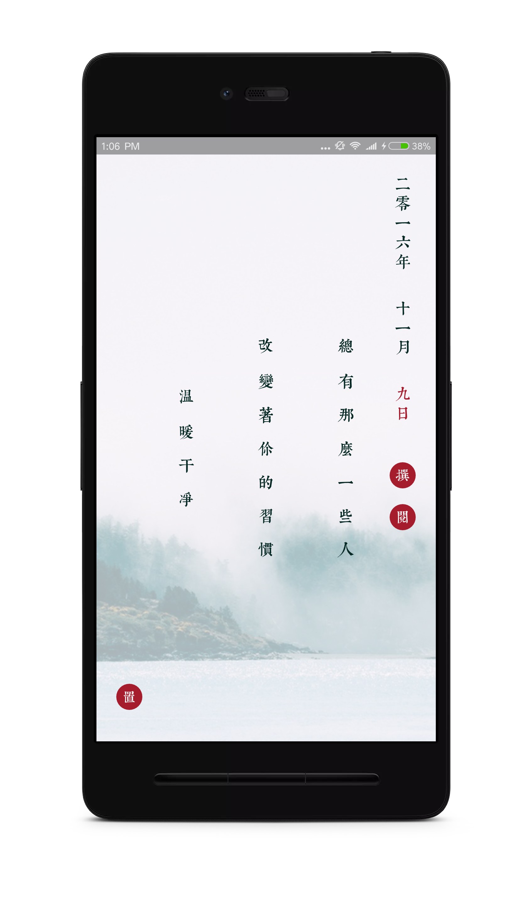
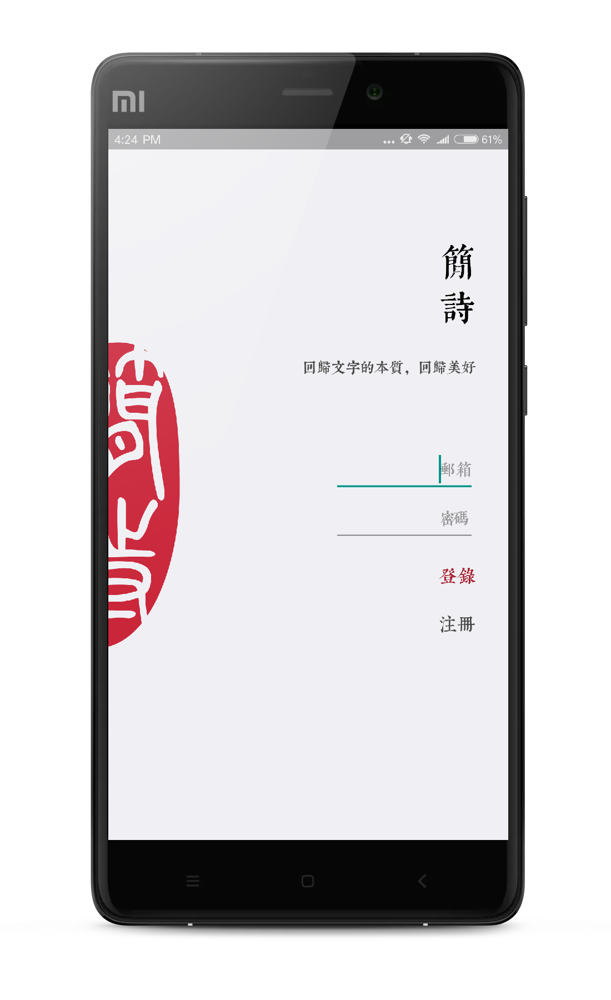
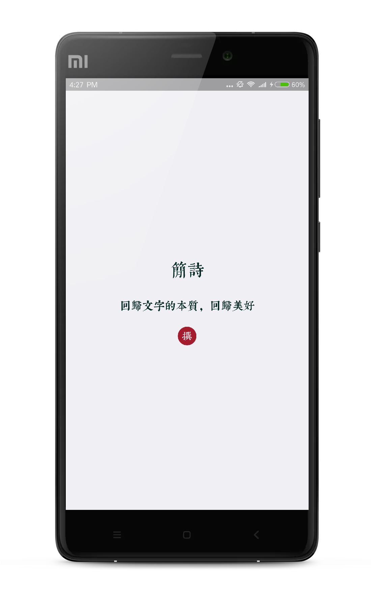
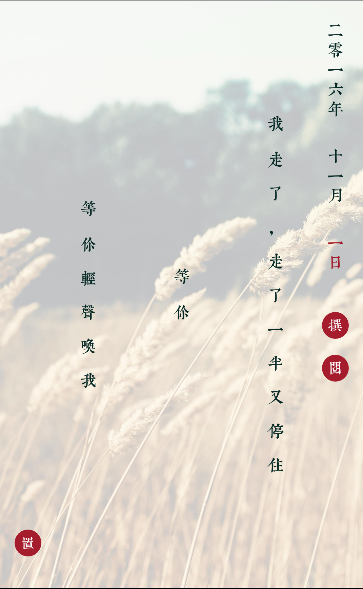
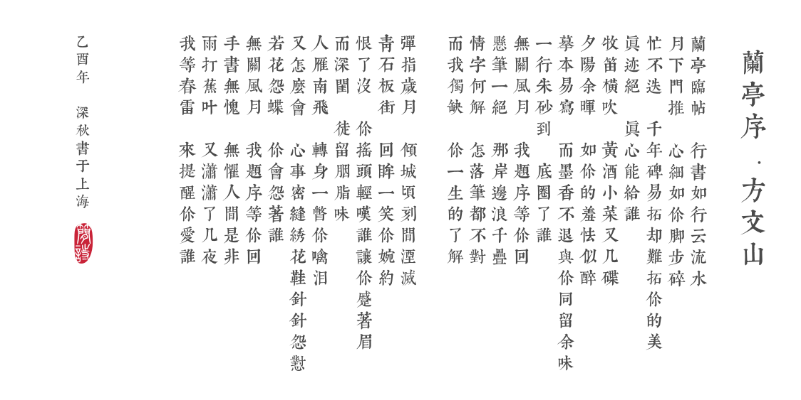

#  JianShi 简诗

A Full-Stack mobile app, including Android side & Server side, Simple-Poem 简诗. You can write poem in graceful & traditional Chinese style. It supports signup & login, data sync with server, offline data storage, screenshot share etc.

一款优雅的中国风Android App，包括Android端和Server端，支持登录注册，数据云端同步，离线数据存储和截屏分享等功能。

[中文说明](https://github.com/wingjay/jianshi/blob/master/CN_README.md)

[下载地址: Fir.im](http://fir.im/vd1r)

# Technology JianShi used
### Android side

Jianshi depends on the most popular Android libraries to build Stable and Clean structure.

- Database:           `DBFlow` to manage sqlite database;
- Network:            `OkHttp3` & `Retrofit2`, and `Stetho` to debug http requests;
- Rx:                 `RxJava` & `RxAndroid`;
- Dependency Inject:  `Dagger2`;
- Logging:            `Timber`;
- Image loading:      `Picasso`;
- Crash monitor:      `Crashlytics`;
- other:              `Eventbus`.

Thanks [`Square`](https://github.com/square) for their great libraries.

### Server side

Jianshi depends on Python & Flask.

The server architecture is:

- www layer: used to receive all http request, process parameters, and call logic layer api for furthure process;
- logic layer: used to process heavy service logic, when there are database actions, it will call db layer;
- db layer: used to wrap our database related actions.

# Android UI

# Chinese Blog for jianshi
[如何在一天之内完成一款具备cool属性的Android产品_简书](http://www.jianshu.com/p/cf496fc408b2)

# Contributor
We build Android & Server together for JianShi.
[wingjay](https://github.com/wingjay), [RayPan](https://github.com/Panl). 

# Development History 

I use my extra time for this project development, so the development process doesn't go very fast.

- __[2016/11/06] Configure aliyun cloud server; Deploy application by jenkins; Setup Nginx & gunicorn; Finish unit-test for signup & data sync logic__
- __[2016/10/30] Design for signup & login; Screenshot for share; Other cool features__
- __[2016/10/25] Data sync between android and server; Improve server error handling function & config mechanism. [Server+Android]__
- __[2016/09/03] User managment in server side and Signup & Login flow in Android side. [Server+Android]__
- __[2016/08/25] Migrate from `LeanCloud` to `Apache + Mysql + wsgi + Flask` and build my own server framework. [Server]__
- __[2016/08/20] Build server side framework. Using `LeanCloud` & `Python`. [Server]__
- __[2016/08/18] Integrate Dagger Retrofit2 OkHttp3 RxJava etc. [Android]__

# Inspired By
[《Producter》](http://producter.io/)

# License
Apache
